# VirtualBox VM Creation, Configuration, and Management

## Overview

This document outlines the steps taken to create, configure, and manage a virtual machine (VM) using VirtualBox. The tasks include creating a new VM, installing Ubuntu, managing snapshots, resizing the virtual hard disk, and modifying system resources.
Screenshots are included to illustrate the key stages of the process.

## 1. VirtualBox Installation

- **Task**: Install the latest version of VirtualBox from the official website.
- **Steps**:
  1. Downloaded VirtualBox from [https://www.virtualbox.org/](https://www.virtualbox.org/).
  2. Installed VirtualBox successfully.
  3. Launched VirtualBox to verify the installation.

_Screenshot 1: VirtualBox installed and running._

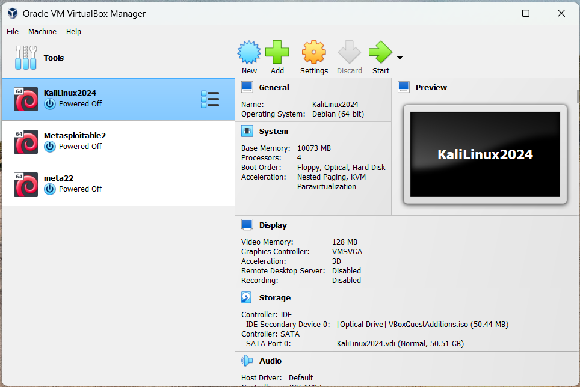

## 2. Creating a New Virtual Machine

- **Task**: Create a new VM named `TestVM` with the following specifications:
  - **Type**: Linux
  - **Version**: Ubuntu (64-bit)
  - **Memory**: 2 GB
  - **Hard Disk**: 20 GB VDI (VirtualBox Disk Image)

- **Steps**:
  1. Opened VirtualBox and selected "New" to create a new VM.
  2. Named the VM `TestVM`, selected `Linux` as the type, and `Ubuntu (64-bit)` as the version.
  3. Allocated 2 GB of RAM.
  4. Created a 20 GB VDI hard disk.

_Screenshot 2: Configuration of the new VM._
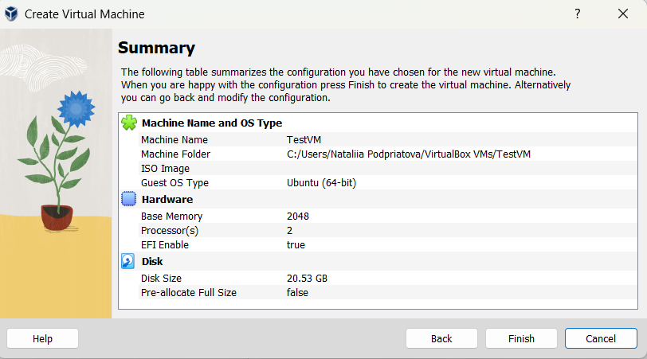

## 3. VM Configuration

- **Task**: Configure the VM with the following settings:
  - **Processors**: 2 cores
  - **EFI**: Enable EFI (special OSes only)
  - **Network Adapter**: Set to Bridged Adapter

- **Steps**:
  1. Accessed the VM settings under the "System" tab.
  2. Set the number of processors to 2 cores.
  3. Enabled EFI under the "Motherboard" tab.
  4. Configured the network adapter to use a Bridged Adapter for direct network access.

_Screenshot 3: VM settings including processors and EFI enabled._

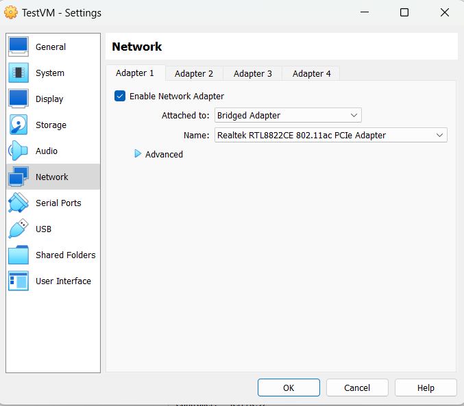

## 4. Installing Ubuntu OS

- **Task**: Install the latest LTS version of Ubuntu on the VM.
- **Steps**:
  1. Downloaded the Ubuntu ISO from the official [Ubuntu website](https://ubuntu.com/download).
  2. Added the ISO as an optical disk in the VM settings.
  3. Started the VM and completed the Ubuntu installation process.

_Screenshot 4: Ubuntu installation on the VM._

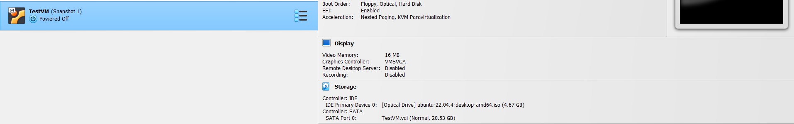

## 5. VM Snapshot Management

- **Task**: Create a snapshot of the VM, perform some tasks, and then restore the snapshot.
- **Steps**:
  1. Created a snapshot of the VM post-installation.
  2. Executed basic commands, such as creating files.
  3. Restored the VM to the snapshot and confirmed that changes were reverted.

_Screenshot 5: Creating and managing VM snapshots._
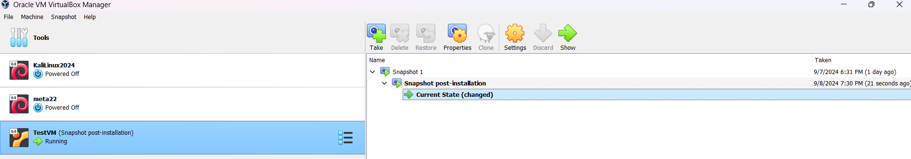

_Screenshot 6: Changed VM state._
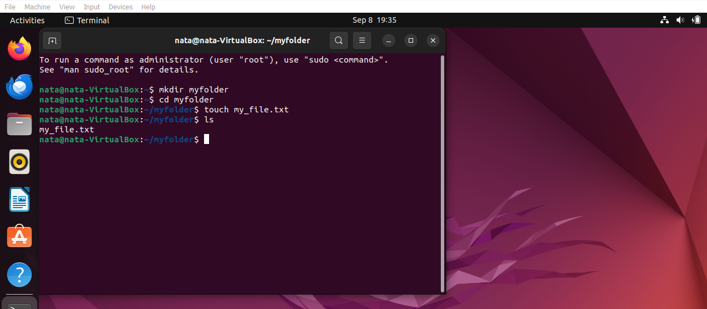

_Screenshot 7: Restored VM to the snapshot
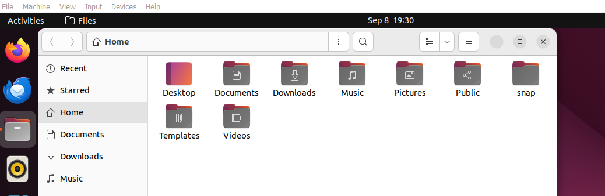

## 6. Changing VM Parameters

- **Task**: Increase the hard disk size and adjust CPU cores and RAM.
  - **Disk Size**: Increase from 20 GB to 30 GB.
  - **CPU Cores**: Increase from 2 to 4 cores.
  - **RAM**: Increase from 2 GB to 4 GB.

- **Steps**:
  1. Powered off the VM and accessed the storage settings.
  2. Resized the hard disk to 30 GB.

_Screenshot 8: Changes in disk size._
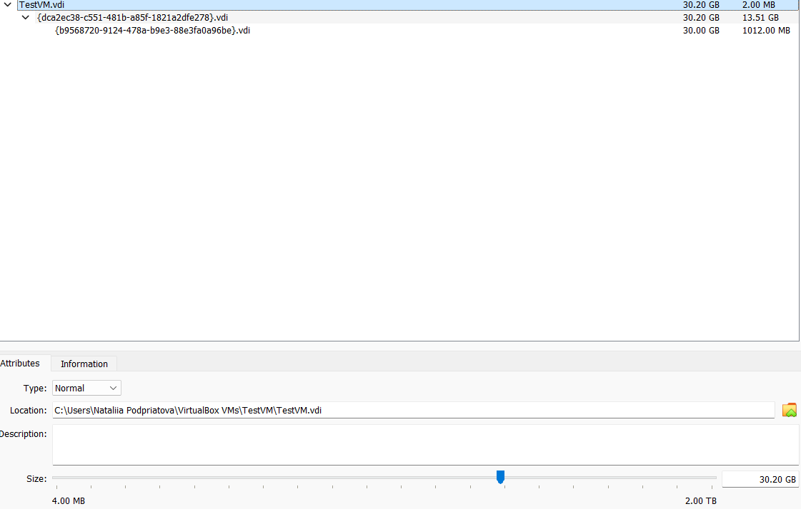

  3. Resize the Partition Inside the VM.
   - Current partition and disk space
   ```bash df -h ```

   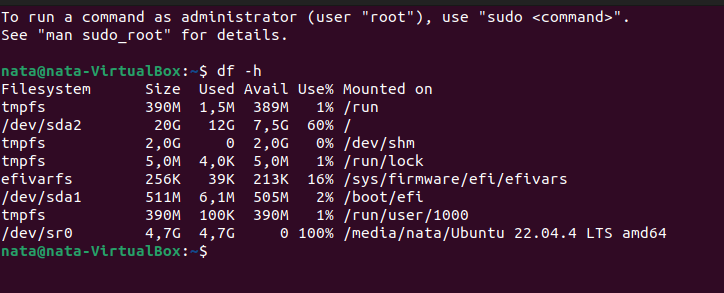

   - Install GParted if not available
  ```bash sudo apt update sudo apt install gparted ```

   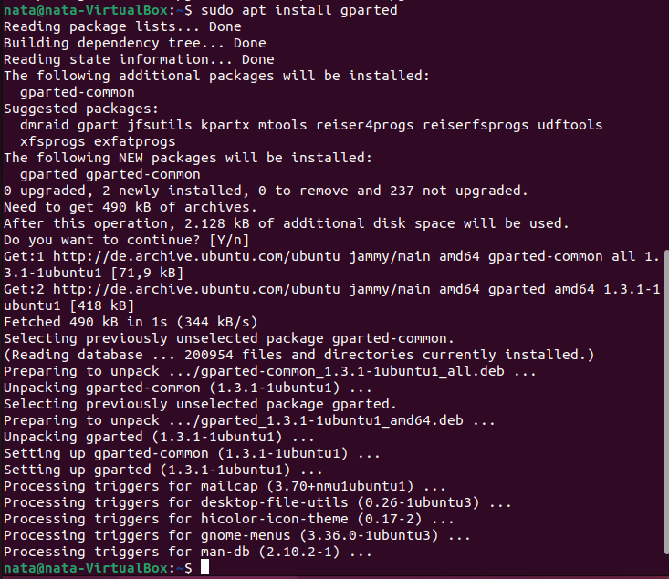

   - Find the partition you want to resize. Right-click on it and select "Resize/Move."
    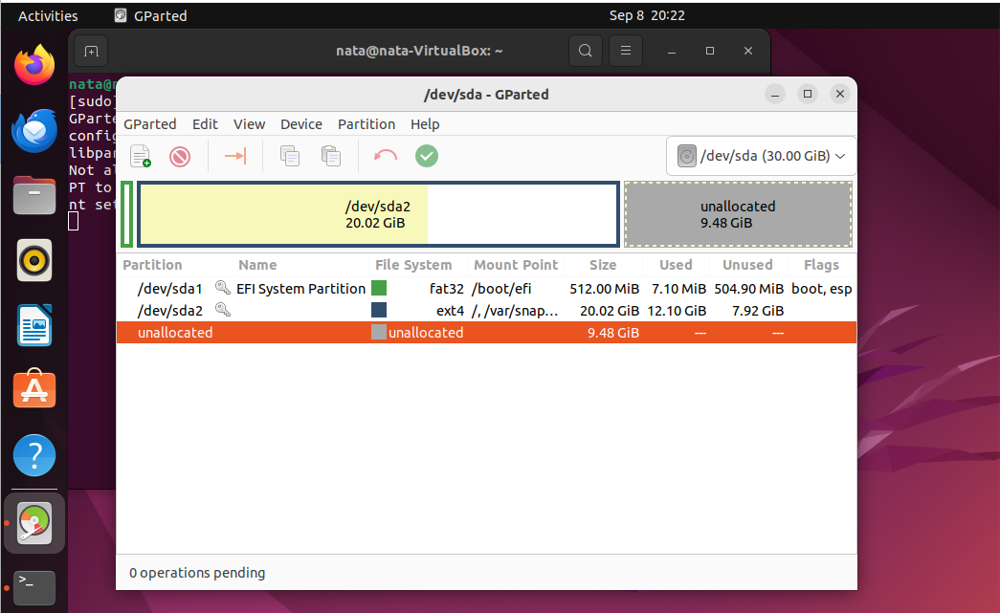

    - Adjust the size to use the unallocated space and apply the changes
    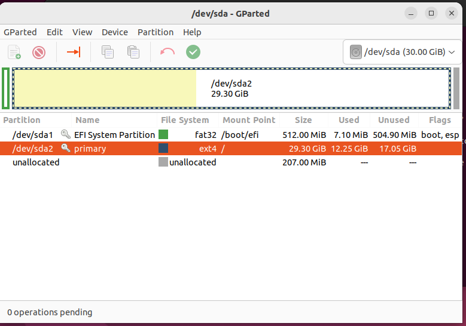

  4. Adjusted the CPU cores to 4 and RAM to 4 GB in the system settings.

  _Screenshot 9: Changes in CPU cores, RAM._
  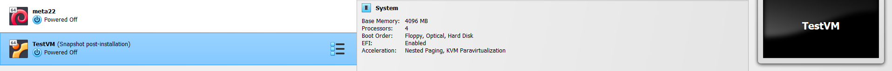

## 7. VM Shutdown and Deletion

- **Task**: Properly shut down and delete the VM along with associated files.
- **Steps**:
  1. Powered off the VM via the Ubuntu interface.
  2. Deleted the VM from VirtualBox, ensuring all files were removed.

_Screenshot 9: Deleting the VM in VirtualBox._

## Conclusion

Throughout this process, I was able to successfully create, configure, and manage a virtual machine using VirtualBox. The use of snapshots provided a reliable method for system recovery after changes. Adjusting system resources through the VirtualBox interface proved to be straightforward, with all changes effectively applied without data loss.

---