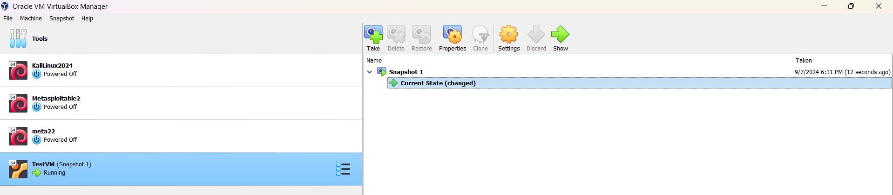

# VirtualBox VM Creation, Configuration, and Management

## Overview

This document outlines the steps taken to create, configure, and manage a virtual machine (VM) using VirtualBox. The tasks include creating a new VM, installing Ubuntu, managing snapshots, resizing the virtual hard disk, and modifying system resources.
Screenshots are included to illustrate the key stages of the process.

## 1. VirtualBox Installation

- **Task**: Install the latest version of VirtualBox from the official website.
- **Steps**:
  1. Downloaded VirtualBox from [https://www.virtualbox.org/](https://www.virtualbox.org/).
  2. Installed VirtualBox successfully.
  3. Launched VirtualBox to verify the installation.

_Screenshot 1: VirtualBox installed and running._
