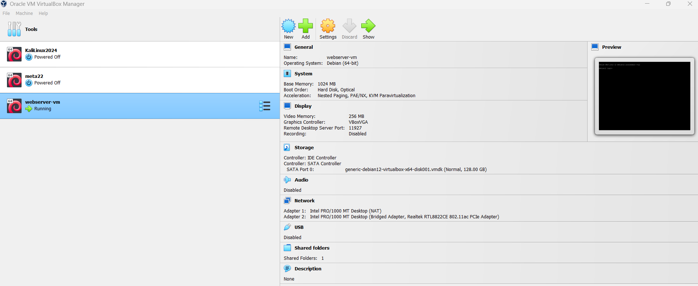
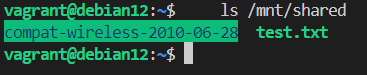
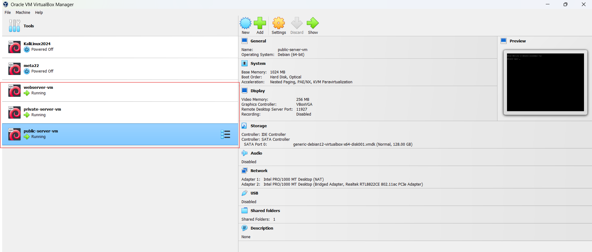
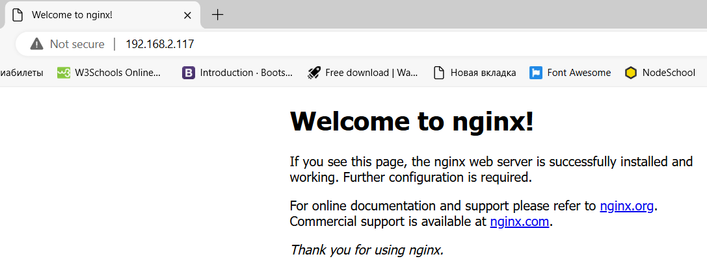

# Vagrant Virtual Machine Setup

This project demonstrates how to set up a public/private web server virtual machine using Vagrant and VirtualBox. The configuration is tailored to create a dynamic web server running on a Debian-based system with shared folders between the host and VM.

Make sure the following software is installed on your system:
- [Vagrant](https://www.vagrantup.com/downloads)
- [VirtualBox](https://www.virtualbox.org/wiki/Downloads)

## Setup Instructions

1. Clone this repository to your local machine.
    ```bash
    git clone https://github.com/NataGildry/DevOps_tasks.git
    cd DevOps_tasks/Lecture_4
    ```

2. Ensure the shared folder path on your host machine is correctly set in the `Vagrantfile`. The current configuration uses `C:/Shared` as the shared folder path on a Windows host. If needed, update it to your desired folder.

3. Run the following command to start the virtual machine:
    ``` bash
     vagrant up --provider=virtualbox
    ```

4. After the VM is up and running, you can SSH into the VM using:
    ``` bash
     vagrant ssh
    ```

5. To view the shared folder inside the VM:
    ``` bash 
    ls /mnt/shared
    ```

## Provisioning

The virtual machine will automatically install nginx during provisioning. You can verify that nginx is running by accessing the public IP address of the VM.

To check the IP address inside the VM, use the following command:
```bash
 ip addr show
```
_Screenshot 1: Configuration of the new VM._


_Screenshot 2: Shared folder inside the VM._


_Screenshot 3: 3 VM created._


_Screenshot 3: Access to the nginx server._
