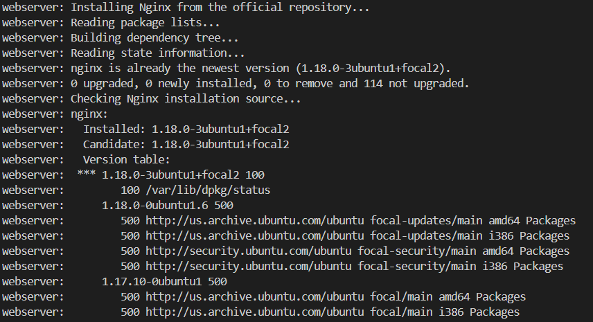
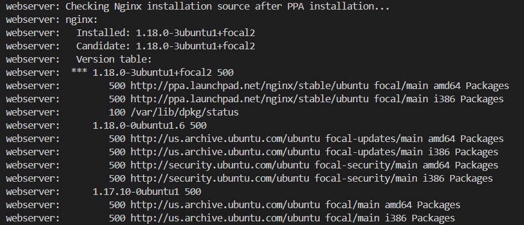
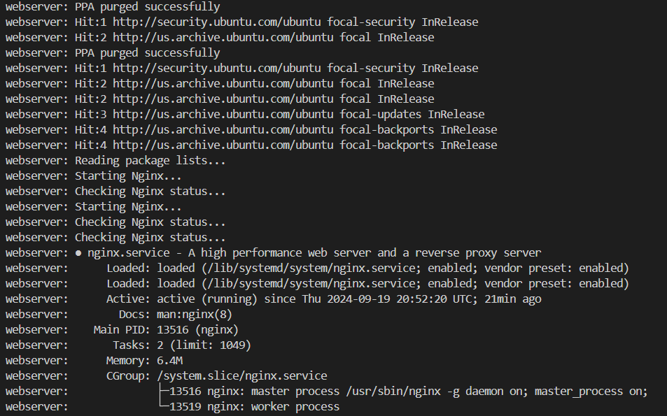

# Server Setup and Configuration
This project provides a step-by-step guide to set up an Nginx web server, configure a custom systemd service, secure your server with UFW and Fail2Ban, and handle disk partitioning and mounting. 

## Prerequisites

Before starting, make sure you have the following:
- [Vagrant](https://www.vagrantup.com/downloads)
- [VirtualBox](https://www.virtualbox.org/wiki/Downloads)
- Ubuntu-based Linux distribution.
- Sudo/root access to install and configure software.

## Setup Instructions

1. Clone this repository to your local machine.
    ```bash
    git clone https://github.com/NataGildry/DevOps_tasks.git
    cd DevOps_tasks/Lecture_4
    ```

2. Ensure the shared folder path on your host machine is correctly set in the `Vagrantfile`.

3. Run the following command to start the virtual machine:
    ``` bash
     vagrant up --provider=virtualbox
    ```

4. After the VM is up and running, you can SSH into the VM using:
    ``` bash
     vagrant ssh
    ```

## Steps Overview

1. **Install and Configure Nginx from Official Repository**
2. **Add Nginx PPA Repository**
3. **Remove the PPA and revert to the official version**

---

### 1. Install and Configure Nginx from Official Repository
 _Screenshot 1: Nginx web server installed from the official repo._
 

 ### 2. Add Nginx PPA Repository
 _Screenshot 2: Nginx PPA repository added successfully._


 ### 3. Remove the PPA and revert to the official version
 _Screenshot 3: Nginx reverted to the official version successfully._


## Conclusion


Made with 🤍 by Nataliia 
---